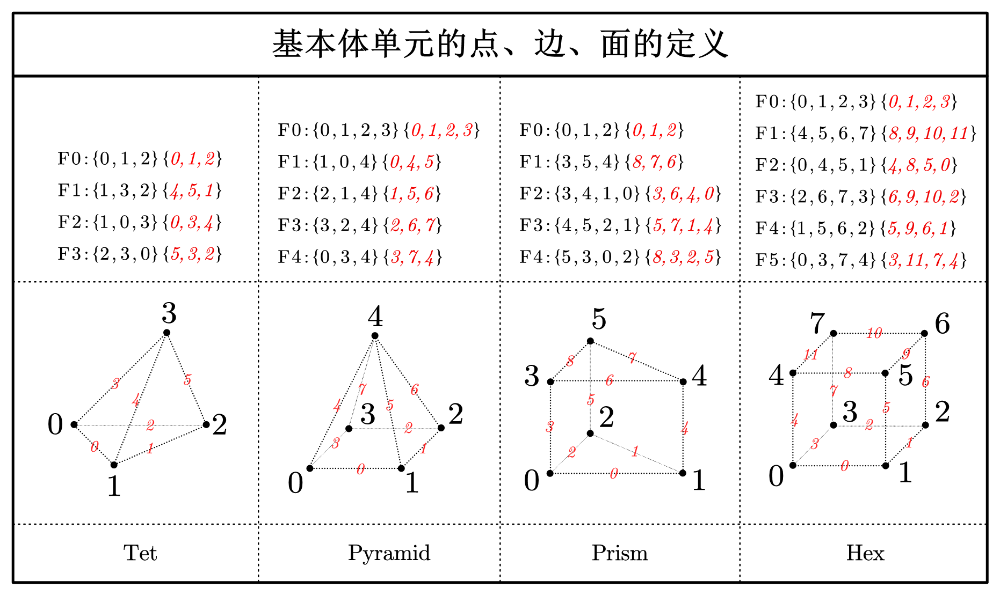

# hMesh：单头文件实现自动维护邻接关系的面网格与体网格

## 描述

hMesh 是一个轻量级的 C++ 头文件库，用于处理面网格和体网格数据结构。它提供了自动维护顶点、边、面和体单元之间邻接关系的功能，支持多种网格元素类型，并包含高效的属性管理系统。

### 主要特性
- 纯头文件实现，无外部依赖
- 轻量核心的网格数据结构
- 面网格支持三角形、四边形和多边形面
- 体网格支持四面体、金字塔、棱柱、六面体和多面体单元
- 添加元素时自动去重（顶点除外）
- 对于非多边形面和非多面体单元使用特定优化策略提升函数效率
- 自动维护拓扑邻接关系
- 灵活的属性系统
- 支持删除时标记和碎片整理
- 支持 .obj 和.mesh网格文件格式的 I/O 操作

### 如何在工程中使用

本库为单头文件库，因此在工程中直接引入头文件即可：`#include <hMesh/hMesh.h>`

## API 概览

### 核心类

#### `SurfaceMesh`
- 面网格类
- 支持添加三角形、四边形和多边形面
- 添加边和面时自动去重
- 添加点时不检查是否重复
- 添加完边和面后不允许修改，只能删除

#### `VolumeMesh`
- 体网格类
- 支持添加四面体、金字塔、三棱柱、六面体和多面体单元
- 添加边、面和体时自动去重
- 添加点时不检查是否重复
- 添加完边、面和体后不允许修改，只能删除

### 核心API

```cpp
/*****************************/
/**** SurfaceMesh的主要API ****/
/*****************************/
size_t numVerts() const; // 获取顶点数量
size_t numEdges() const; // 获取边数量
size_t numFaces() const; // 获取面数量

Index addVert(const VertexContainer &vert); // 添加顶点
Index addEdge(Index a, Index b); // 添加边
Index addFace(const Index *verts, size_t numVerts); // 添加面

void removeVert(Index id); // 删除顶点
void removeEdge(Index id); // 删除边
void removeFace(Index id); // 删除面
bool isVertRemoved(Index id) const; // 顶点是否已被删除
bool isEdgeRemoved(Index id) const; // 边是否已被删除
bool isFaceRemoved(Index id) const; // 边是否已被删除
void setVertDeletionCallback(DeletionCallback cb); // 设置顶点的删除回调
void setEdgeDeletionCallback(DeletionCallback cb); // 设置边的删除回调
void setFaceDeletionCallback(DeletionCallback cb); // 设置面的删除回调

VertexContainer &getVert(Index id); // 获取顶点
const EdgeContainer &getEdge(Index id) const; // 获取边
const FaceContainer &getFace(Index id) const; // 获取面
AttributeManager &getVertAttributes(); // 获取顶点的属性管理器
AttributeManager &getEdgeAttributes(); // 获取边的属性管理器
AttributeManager &getFaceAttributes(); // 获取面的属性管理器

const set<Index> &vertEdges(Index vid) const; // 获取点的邻接边
const set<Index> &vertFaces(Index vid) const; // 获取点的邻接面
const set<Index> &edgeFaces(Index eid) const; // 获取边的邻接面

Index getEdgeIndex(Index a, Index b) const; // 获取边的索引
Index getFaceIndex(const Index *verts, size_t numVerts); // 获取面的索引

size_t removeIsolatedVerts(); // 移除孤立顶点
size_t removeIsolatedEdges(); // 移除孤立边

bool isIndexContinuous() const; // 元素（包括顶点、边和面）索引是否连续
void defragment(); // 碎片整理（包括顶点、边和面）

void clear(bool keepAttributes); // 清空网格
void clearAttributes(); // 清除所有属性数据

void copyFrom(const SurfaceMesh &other, bool copyAttributes); // 拷贝另一个网格

// 顶点的迭代器...
// 边的迭代器...
// 面的迭代器...

/****************************/
/**** VolumeMesh的主要API ****/
/****************************/
// 包括所有面的API...
size_t numCells() const; // 获取体数量
Index addCell(const Index *verts, size_t numVerts, ...); // 添加体
const CellContainer &getCell(Index id) const; // 获取体
AttributeManager &getCellAttributes(); // 获取体的属性管理器
Index getCellIndex(const Index *verts, size_t numVerts, ...) const; // 获取体的索引
void removeCell(Index id); // 删除体
bool isCellRemoved(Index id) const; // 体是否已被删除
void setCellDeletionCallback(DeletionCallback cb); // 设置体的删除回调
bool isIndexContinuous() const; // 元素（包括顶点、边、面和体）索引是否连续
void defragment(); // 碎片整理（包括顶点、边、面和体）
size_t removeIsolatedFaces(); // 删除孤立面
const std::set<Index> &vertCells(Index vid) const; // 获取点的邻接体
const std::set<Index> &edgeCells(Index eid) const; // 获取边的邻接体
const std::set<Index> &faceCells(Index fid) const; // 获取面的邻接体
// 体的迭代器...

/****************************/
/********* 文件I/O **********/
/****************************/
void LoadObj(const std::string& filename, EasySurfaceMesh<...>& m); // 加载.obj文件
void SaveObj(const std::string &filename, const SurfaceMesh<...> &mesh, int precision); // 保存.obj文件

void LoadMesh(const std::string &filename, VolumeMesh<...> &m); // 加载.mesh文件（不能加载多面体）
void SaveMesh(const std::string& filename, const VolumeMesh<...>& m, int precision); // 保存.mesh文件（不能保存多面体）
```

### 关键机制
- **删除有效性检查**。删除时会检查元素是否被更高级元素引用，如果存在引用，则无法删除。例如：当删除顶点时，若该顶点存在邻接边或邻接面，则删除失败。
- **索引可能非连续**。 若从未使用过任何会导致元素删除的函数，则顶点、边、面和体的索引是从0开始的连续整数。若删除某元素，并不会改变后添加的元素的索引，而是把该索引加入空闲列表供后面使用。因此依据元素数量来遍历元素的行为是不安全的。若要使得索引连续，则需要手动调用`defragment`函数。
- **索引循环利用**。删除时并非真正移除该元素，只是将该索引加入空闲列表中。当再次增加同类元素时，会从空闲列表中取出一个索引再次利用。例如：若索引为A的边已被删除，且空闲列表中只有A。当再次添加边时，该边的索引则为A。
- **元素相同的依据**。不同的元素拥有不同的相同判定规则。对于边，若两条边的顶点集合相同，则认为二者相同。对于面，若两个面的有序顶点列表等价（顺时针或逆时针列表相等），则认为二者相同，例如若F0={0,1,2}，则当F1={0,1,2}/{1,2,0}/{2,0,1}/{2,1,0}/{1,0,2}/{0,2,1}时二者相同。对于非多面体单元，若两个体的类型和顶点集合相同，则认为二者相同。对于多面体单元，若两个体的类型和面集合相同，则认为二者相同。
- **低级元素自动删除**。删除元素后，当属于删除的元素的低级元素无其他相连的高级元素，则该低级元素自动删除。删除的过程是递归的，直到删除到边为止，顶点永远不会自动删除。例如：当删除一个四面体后，发现四面体的某个面再无其他相连的体，则自动删除该面，面删除完毕后再检查边。
- **顶点永远不会自动删除**。当高级元素被删除时，会检查并删除属于它的低级元素，但顶点除外。顶点只能手动删除。

### 基本体单元的定义




## 使用范例

### 创建一个三角形和四边形

```cpp
SurfaceMesh mesh;

// 添加五个顶点
mesh.addVert({0.0, 0.0, 0.0});
mesh.addVert({1.0, 0.0, 0.0});
mesh.addVert({1.0, 1.0, 0.0});
mesh.addVert({0.0, 1.0, 0.0});
mesh.addVert({2.0, 0.0, 0.0});

// 添加一个三角形
mesh.addFace<FaceType::FACE_TRI>({1, 4, 2});

// 添加一个四边形
mesh.addFace<FaceType::FACE_QUAD>({0, 1, 2, 3});

// 保存网格
io::SaveObj("surf.mesh", mesh);
```

### 创建一个四面体

```cpp
VolumeMesh mesh;

// 添加四个顶点
mesh.addVert({0, 0, 0});
mesh.addVert({1, 0, 0});
mesh.addVert({1, 1, 0});
mesh.addVert({0, 0, 1});

// 添加一个四面体
mesh.addCell<CellType::CELL_TET>({0, 1, 2, 3});

// 保存网格
io::SaveMesh("tet.mesh", mesh);
```

### 添加属性

```cpp
SurfaceMesh mesh;

using Color = std::array<double, 3>; // 颜色数据结构

// 为顶点添加颜色属性，默认值为黑色
mesh.getVertAttributes().addAttribute<Color>("color", {0.0, 0.0, 0.0});

// 添加一个顶点
mesh.addVert({0.0, 0.0, 0.0});

// 设置顶点颜色
auto* colors = mesh.getVertAttributes().getAttribute<Color>("color");
colors->setElement(0, {1.0, 0.0, 0.0});  // 第一个顶点设为红色
```

### 遍历元素

```cpp
SurfaceMesh mesh;

// 错误！！！若删除过元素，则索引可能不连续
for(size_t id = 0; id < mesh.numVerts(); ++id) {
    std::cout << "Vertex id: " << *it << std::endl;
}

// 正确。第一种遍历顶点索引的方法
for (auto id : mesh.vertIndices()) {
    std::cout << "Vertex id: " << id << std::endl;
}

// 正确。第二种遍历顶点索引的方法
for (auto it = mesh.vertIndexBegin(); it != mesh.vertIndexEnd(); ++it) {
    std::cout << "Vertex id: " << *it << std::endl;
}
```

### 查询邻接关系

```cpp
// 创建包含多种单元类型的网格
VolumeMesh mesh;

// 加载体网格数据
io::LoadMesh("vol.mesh", mesh);

// 查询点的邻接体索引
for (auto vid : mesh.vertIndices()) {
    const auto& cells = complexMesh.vertCells(vid);
    std::cout << "Vertex " << vid << " is part of " << cells.size() << " cells\n";
}
```

## 性能提示

1. 对于大规模网格，使用 `defragment()` 可以优化内存布局
2. 使用 `isIndexContinuous()` 检查索引连续性
3. 移除孤立元素可减少内存占用
4. 若想在删+增的过程中保持低级元素索引不变，可以调整为增+删。这样删除的时候就不会因为低级元素孤立而被删除
5. 使用指针指向边内部的数组是十分危险的行为，例如：`auto vptr= mesh_.getEdge(eid).verts();`和`auto eptr= mesh_.getEdge(eid).edges();`，因为若后续进行增删或整理碎片，很有可能因为边数组扩容而导致指针失效。正确的方法是使用变量保存具体的值。但指向面和体内部的数组是安全的，因为这二者使用智能指针存储，所以并不会因为数组扩容而失效。

## 许可证

```
MIT License

Copyright (c) [2025] [dtc]

Permission is hereby granted, free of charge, to any person obtaining a copy
of this software and associated documentation files (the "Software"), to deal
in the Software without restriction, including without limitation the rights
to use, copy, modify, merge, publish, distribute, sublicense, and/or sell
copies of the Software, and to permit persons to whom the Software is
furnished to do so, subject to the following conditions:

The above copyright notice and this permission notice shall be included in all
copies or substantial portions of the Software.

THE SOFTWARE IS PROVIDED "AS IS", WITHOUT WARRANTY OF ANY KIND, EXPRESS OR
IMPLIED, INCLUDING BUT NOT LIMITED TO THE WARRANTIES OF MERCHANTABILITY,
FITNESS FOR A PARTICULAR PURPOSE AND NONINFRINGEMENT. IN NO EVENT SHALL THE
AUTHORS OR COPYRIGHT HOLDERS BE LIABLE FOR ANY CLAIM, DAMAGES OR OTHER
LIABILITY, WHETHER IN AN ACTION OF CONTRACT, TORT OR OTHERWISE, ARISING FROM,
OUT OF OR IN CONNECTION WITH THE SOFTWARE OR THE USE OR OTHER DEALINGS IN THE
SOFTWARE.
```

## 未来计划

欢迎贡献代码和提出建议！